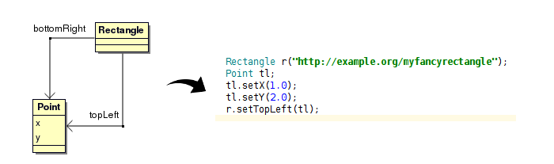

# AutoRDF
A framework for C++ proxy class generation from Web Ontology Language

# Objectives
AutoRDF is a framework that makes it easy to manipulate concepts described in Web Ontology Language (OWL) within C++ code. It makes it a lot easier to manipulate RDF data within low level, algorithmic code that can be found in embedded software projects.

It hides away most of the complexity of OWL/RDF technologies, and makes it easy for the developer to concentrate on its business logic with familiar C++ objects rather than on how its data is read from or written to persistent storage.

# Content
AutoRDF contains:
 - autordf library that is a C++ layer on top of Redland to provide easier manipulation of RDF datasets, as well as a generic RDF Object class
 - autordf-ontology library that parses a RDFS or OWL ontology and generates an internal representation
 - autordfcodegen: A tool on top of autordf-ontology to generate C++ proxy code
 - autordfxmi: A tool on top of autordf-ontology to generate a partial UML representation

# Requirements
AutoRDF is based upon Redland library found at http://librdf.org/

# Compatibility
AutoRDF should work on any platform where a C++11 compiler is found, and where boost is supported.
Currently only Linux/Clang 3.5 is tested, but soon it will be ready for iOS/Android as well.

# Video introduction

